<div align="center">

# Ori and the Blind Forest 모작

**원작의 핵심 이동·전투 메커닉을 분석해 독자적인 구조로 재구현한 Unity 2D 액션 플랫포머**

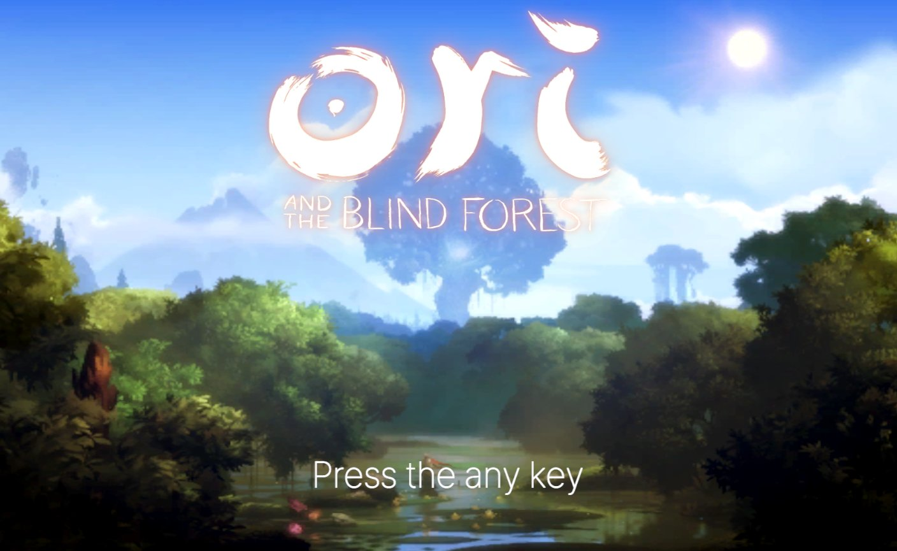


</div>

<br/>

## 📌 프로젝트 개요

| 항목 | 내용 |
|---|---|
| **장르** | 2D 액션 플랫포머 |
| **엔진** | Unity 6000.2.8f1 (C#) |
| **개발 기간** | 2026.08.11 ~ 2026.08.25 (2주) |
| **개발 인원** | 1인 개발 (기획 · 프로그래밍 전담) |
| **플랫폼** | PC (Windows) |
| **기술개발서** | 슬라이드 기반 기술개발서 별도 제작 |

원작 특유의 **관대하고 반응성 높은 이동감**, 시그니처 스킬인 **바쉬(Bash)**, **소울 파밍 → 세이브** 루프를 재현하는 것을 목표로 했습니다. 인트로부터 타이틀, 튜토리얼, 스테이지 진행, 체크포인트 리스폰까지 하나의 게임 흐름으로 동작합니다.

<br/>

## 🎮 조작법

| 입력 | 동작 |
|---|---|
| `A` `D` / `←` `→` | 이동 |
| `Space` | 점프 · 2단 점프 (길게 누르면 더 높이) |
| `S` + `Space` | 아래 발판 통과 |
| `W` 홀드 후 떼기 | 슈퍼 점프 |
| `Left Shift` | 대시 |
| `Left Ctrl` 홀드 (공중) | 패러세일 (활공) |
| 벽 방향 입력 + `Space` | 벽 매달리기 · 벽 점프 |
| `마우스 우클릭` 홀드 → 조준 → 떼기 | 바쉬 |
| `마우스 좌클릭` | 세인 공격 (홀드 시 차지 폭발) |
| `E` 홀드 (지상) | 세이브 포인트 생성 |
| `W` / `S` (지상) | 카메라 위/아래 미리보기 |
| `ESC` | 일시정지 |

<br/>

## 🔄 게임 흐름

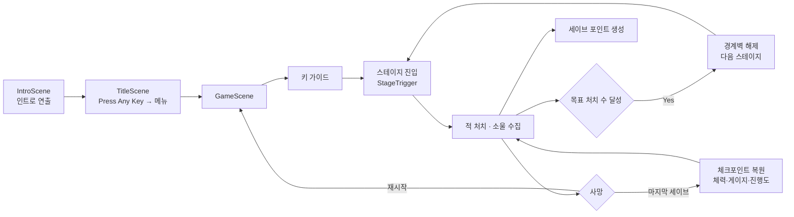

<br/>

## ⚙️ 핵심 시스템

### 01. 인트로 연출 · `IntroSequence.cs`

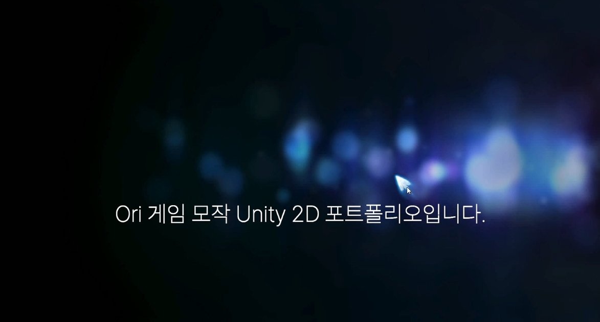

스팀 게임 특유의 시작 화면 연출을 재현했습니다.

- 슬라이드 데이터를 `[System.Serializable]` 클래스로 묶어 인스펙터에서 슬라이드 순서·유지 시간을 편집
- 각 슬라이드에 `CanvasGroup`을 두고 Fade In/Out 연출
- 클릭 시 전체 스킵이 아닌 **한 장씩 스킵**, 스킵할 때도 짧은 페이드를 유지해 화면 전환이 어색하지 않도록 설계
- 씬 전환은 `SceneTransitionMgr`(DontDestroyOnLoad + `unscaledDeltaTime` 기반 페이드)가 담당

<br/>

### 02. 플레이어 컨트롤 · `PlayerCtrl`

<table>
<tr>
<td>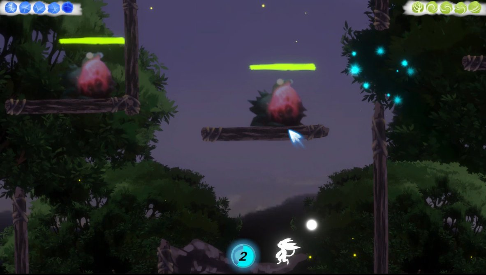</td>
<td>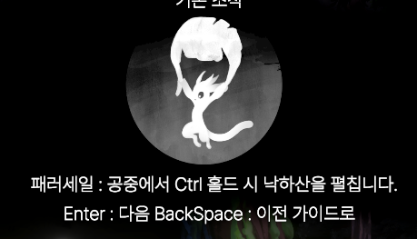</td>
</tr>
</table>

원작 특유의 관대하고 반응성 높은 이동감을 목표로 했습니다.

- 기본 이동, 가변 높이 점프, 2단 점프, 패러세일, 대시, 슈퍼 점프, 발판 통과
- 공중 방향 전환 시 가속도를 다시 쌓아 미끄러지듯 부드럽게 전환, 낙하 중 중력 가중으로 경쾌한 점프 곡선
- **벽 점프**는 단순 충돌 판정이 아니라 `OverlapCircle` 벽 감지 + **입력 버퍼**(`wallInputBufferTime`) + **벽 코요테 타임**(`wallCoyoteTime`)을 조합해, 벽에서 막 떨어진 직후에도 일정 시간 입력을 허용
- 발판 통과는 아래쪽에 내려갈 지형이 있을 때만 레이어 충돌을 잠시 무시하고, 없으면 제자리 점프로 처리

<br/>

### 03. 전투 시스템 · `SeinCtrl.cs`

<table>
<tr>
<td>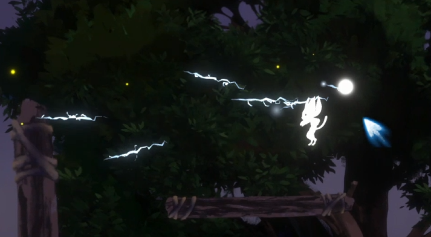</td>
<td>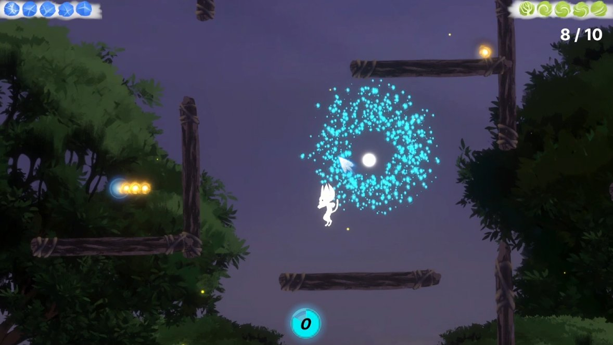</td>
</tr>
</table>

플레이어를 따라다니며 공격하는 전투 동료 **세인**을 구현했습니다.

- `SmoothDamp` 기반 플레이어 추적 + 사인파 부유 연출
- 좌클릭 공격 시 범위 내 **가장 가까운 적을 자동 조준**, 적이 없으면 각도를 순환하는 스프레드 패턴으로 발사
- 좌클릭 홀드 시 **차지 폭발** (스킬 게이지 1 소모) — `OverlapCircleAll`로 범위 내 `IDamageable`에 피해를 주고 카메라 쉐이크로 타격감 연출
- 투사체는 오브젝트 풀링(`BulletPool`)으로 관리

<br/>

### 04. 카메라 시스템 · `CameraCtrl.cs`

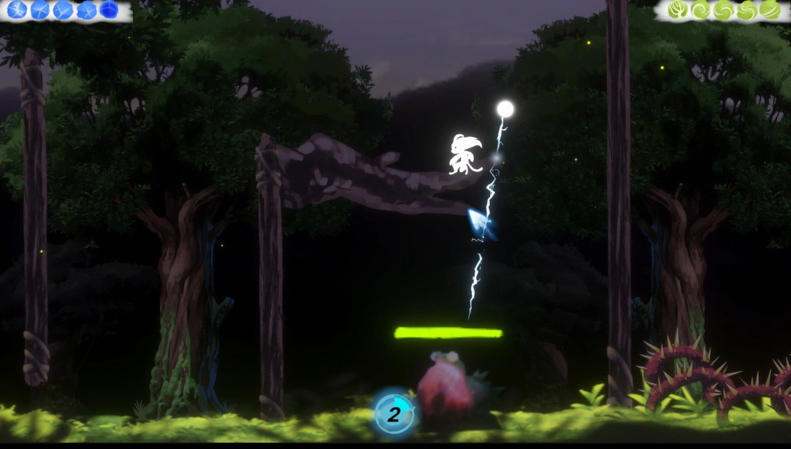

- 룩어헤드(Look-ahead) + Y축 데드존으로 수직 이동 시 흔들림 최소화
- 배경 기준 맵 경계값을 자동 계산해 스테이지 밖이 보이지 않도록 제한
- `W`/`S` 화면 미리보기 — 대각선 점프 입력과 겹치지 않도록 지상 상태에서만 동작하게 조건 분리
- 공격 종류에 따라 강도를 다르게 줄 수 있는 카메라 쉐이크

<br/>

### 05. 체력 & 스킬 게이지 · `PlayerHealth.cs`

 &nbsp; 

- 하트 UI 기반 체력, 피격 시 무적 시간과 `MaterialPropertyBlock` 피격 플래시
- `IDamageable` 인터페이스로 플레이어·적·오브젝트의 데미지 처리 구조를 통일
- 스킬 게이지를 `PlayerHealth`에 통합하고 `FillSkillGauge` / `UseSkillGauge` / `CurrentSkillGauge`로 충전·소모·조회 API를 일원화
- 무적 원인을 **외부 요청(바쉬 등)** 과 **피격 직후** 두 가지로 분리해, 한쪽이 끝나도 다른 쪽 무적이 풀리지 않도록 처리

<br/>

### 06. 세이브 게이지 & 체크포인트

<table>
<tr>
<td>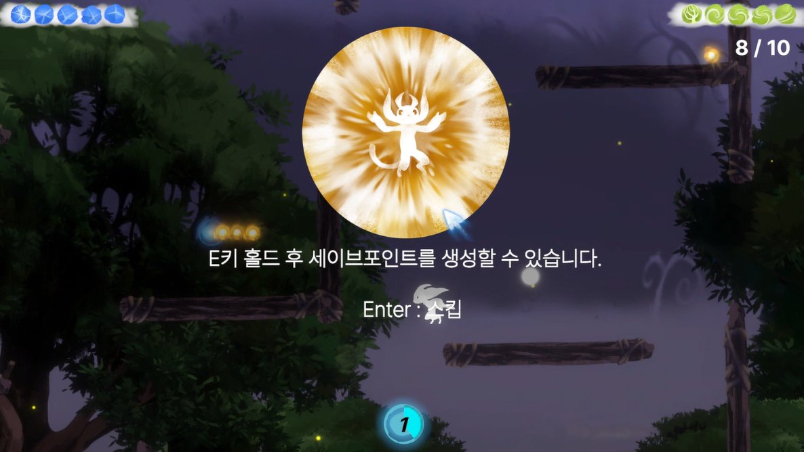</td>
<td>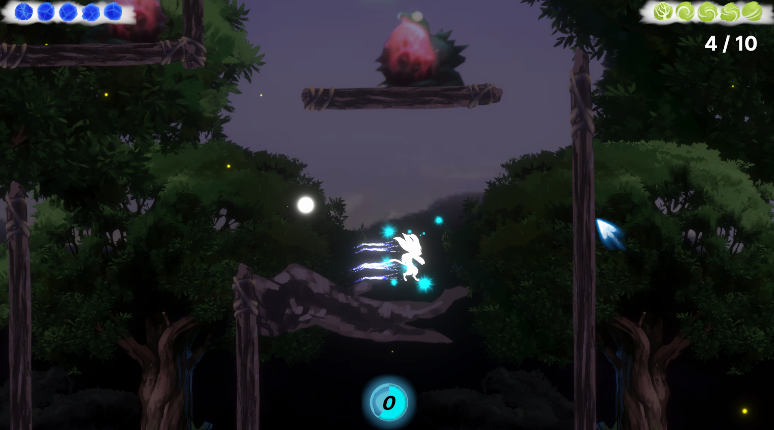</td>
</tr>
</table>

원작의 **소울 파밍 → 세이브** 루프를 재현했습니다.

- 소울 10개 누적 → 원형 게이지 1바퀴 → 세이브 포인트 +1
- `E` 1초 홀드 + 지상 상태 + 게이지 보유 조건을 모두 만족할 때만 생성
- 생성 시점의 위치·체력·스킬 게이지·세이브 게이지·스테이지 처치 진행도를 `CheckpointSnapshot`으로 저장하고, 리스폰 시 이벤트로 복원
- 게이지 연출은 DOTween Sequence + `SetUpdate(true)`로 일시정지 중에도 정상 동작

<br/>

### 07. 바쉬 (Bash)

<table>
<tr>
<td>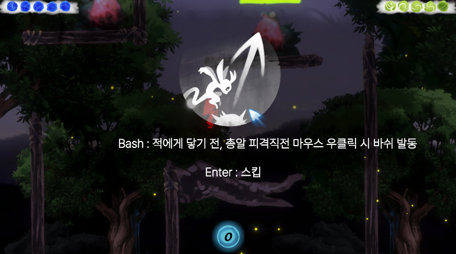</td>
<td>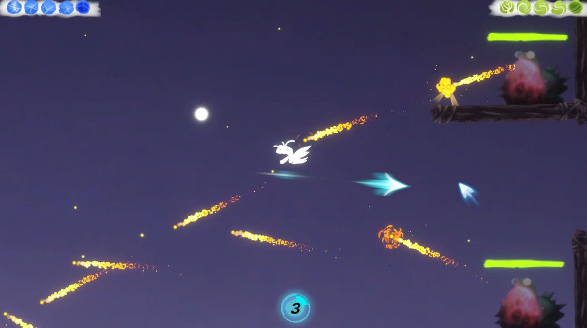</td>
</tr>
</table>

원작의 시그니처 메커닉인 **적·투사체를 발판 삼아 튕겨 나가는 이동**을 재현했습니다.

- `Physics2D.OverlapCircle`로 반경 내 바쉬 가능한 레이어가 있을 때만 발동, 반경과 레이어를 인스펙터에서 조절해 난이도 튜닝과 확장이 쉬움
- 조준 중 슬로우모션, 마우스 방향으로 화살표 표시
- 조준 시작부터 발사 종료까지 **전 구간 무적** — 판정 타이밍 오차로 인한 억울한 피격 차단
- 최대 조준 시간을 `unscaledDeltaTime`으로 계산해 슬로우모션 영향을 받지 않도록 제한
- 위쪽 발사 시 Y 성분만 완화해 과도한 수직 상승 방지, 발사 후 점프 횟수 리필

<br/>

### 08. 튜토리얼 시스템 · `TutorialMgr` / `TutorialPrompt`

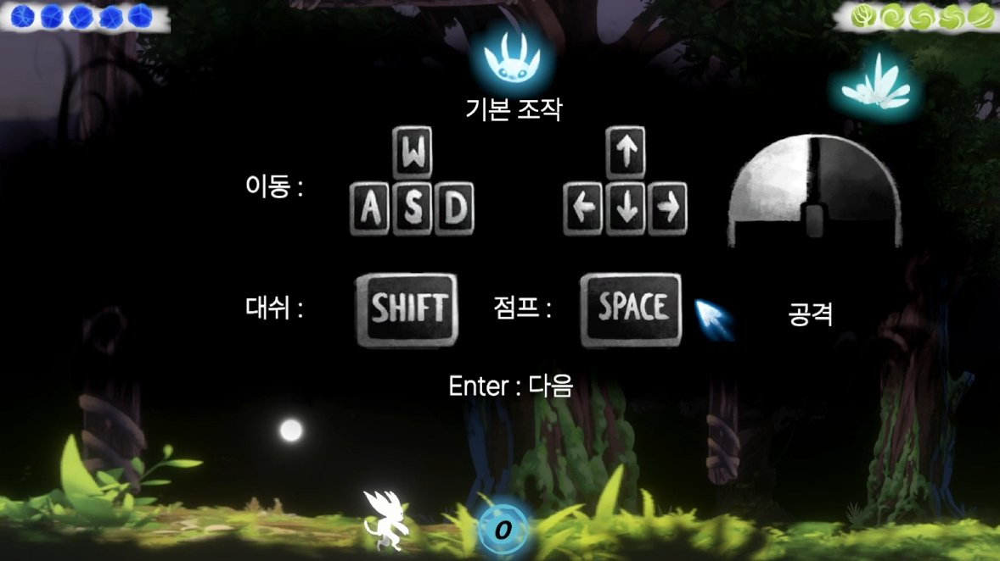

- 게임 시작 시 멀티 슬라이드 키 가이드(`KeyGuideSequence`), 연타 시 중복 전환 방지
- 위치 기반 트리거보다 **피격·스킬 획득 등 이벤트 기반 트리거**를 우선 적용
- `Dictionary` + `TutorialIds` 상수 클래스로 ID 관리, 여러 튜토리얼이 동시에 요청되면 큐로 순차 노출
- `HasSeen` / `MarkSeen`으로 같은 세션에서 재시도·리스폰 후 반복 노출 방지

<br/>

### 09. 적 AI 시스템 · `EnemyBase`

<table>
<tr>
<td>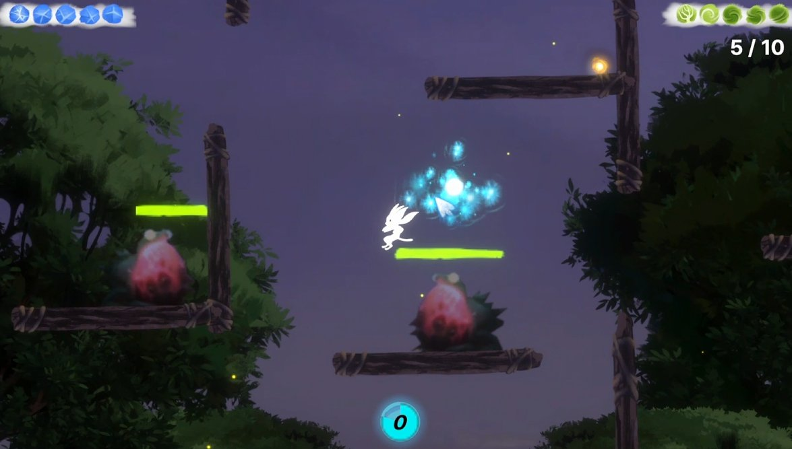</td>
<td>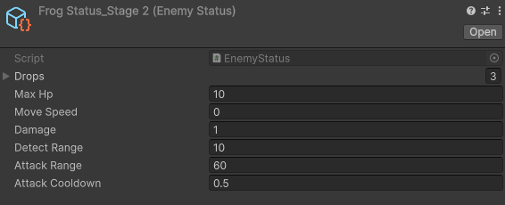</td>
</tr>
</table>

- 추상 클래스 `EnemyBase` + `ScriptableObject` 스탯(`EnemyStatus`)으로 데이터와 로직 분리
- 원거리(Frog), 점프 추격(Jumper), 비행(Eagle), 지뢰(Mine), 벽 타기(WallCrawler) 등 파생 적 구현
- 접촉 데미지·넉백을 `virtual OnTriggerStay2D`로 공통 처리, 드롭 테이블 기반 아이템 드롭
- `EnemySpawner`의 리스폰 관리, `StageTrigger`로 스테이지 단위 활성화/비활성화
- `SpikeObstacle`은 `EnemyBase`를 상속하지 않는 독립 컴포넌트로, 물리용·데미지용 콜라이더를 분리

<br/>

### 10. 게임 매니저 & 씬 관리 · `GameManager` / `SceneTransitionMgr`

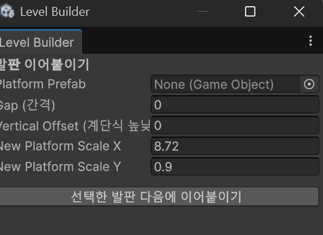

- `AcquireFreeze()` / `ReleaseFreeze()` **카운터 패턴**으로 여러 시스템이 동시에 시간을 멈춰도 충돌하지 않도록 처리
- `GameEvents` 정적 이벤트 허브로 매니저 간 직접 참조 최소화
- 씬 재로드마다 `GameSceneRefs`가 UI 참조와 버튼 이벤트를 재등록
- 보조 시스템: `ItemPickup`(자석 흡수), `StageManager` 배너 연출, 발판을 이어 붙이는 에디터 툴 `LevelBuilderWindow`

<br/>

## 🏗️ 플레이어 구조 리팩토링

초기 `PlayerCtrl`은 700줄 가까운 단일 파일에서 `isDashing`, `isClimbing`, `isBashing` 같은 bool 플래그로 상태를 관리했습니다. 스킬이 늘어날수록 `!isDashing && !isClimbing && !isWallJumping && !isBashing` 같은 조건이 여러 곳에 흩어져, 새 액션 하나를 넣을 때마다 수정 지점이 늘어나는 문제가 있었습니다.

이를 **열거형 상태 머신 + partial class 파일 분리** 구조로 리팩토링했습니다.

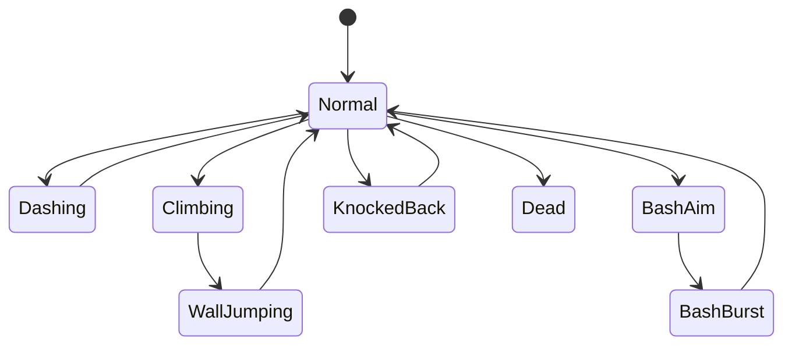

- 상태 전환은 `ChangeState()` 한 곳으로만, 진입·퇴장 시 정리(애니메이터, 슬로우모션, 무적, 트레일)는 `EnterState` / `ExitState`에서 처리
- 어떤 행동이 어느 상태에서 허용되는지는 `CanMove`, `CanJump`, `CanDash`, `CanStartBash` 등 **규칙 프로퍼티 한 곳**에서 결정
- 대시·벽점프 잠금·넉백·바쉬 발사를 코루틴 대신 `stateTimer`로 진행해 중복 실행과 정리 누락 방지
- 컴포넌트는 하나로 유지하고 파일만 기능별로 분리(`PlayerCtrl.Jump.cs`, `.Climb.cs`, `.Bash.cs` 등) — **씬에 저장된 인스펙터 값과 외부 공개 API를 그대로 보존**

<br/>

## 🛠️ 트러블슈팅

| 문제 상황 | 원인 | 해결 방법 |
|---|---|---|
| 일시정지(timeScale 0) 중 UI 연출이 멈춤 | DOTween 트윈이 기본적으로 스케일 타임 기준으로 동작 | Tween에 `SetUpdate(true)` 적용, 씬 전환 페이드는 `unscaledDeltaTime` 사용 |
| 튜토리얼 매니저 초기화 순서에 따라 등록 누락 | 여러 `Awake()`의 실행 순서가 보장되지 않아 프롬프트가 매니저보다 먼저 초기화되는 경쟁 상태 | `TutorialMgr.Awake()`에서 `FindObjectsByType`으로 씬 전체를 스캔해 일괄 등록 |
| 여러 튜토리얼이 동시에 시간을 멈출 때 충돌 | bool 플래그로 제어하면 하나가 해제될 때 다른 요청까지 함께 풀림 | `AcquireFreeze()` / `ReleaseFreeze()` 카운터 패턴 도입, 카운터가 0일 때만 실제 해제 |
| 게임 재시작 시 UI 참조가 깨짐 (NullReferenceException) | 씬 재시작 시 기존 UI 오브젝트와 참조가 파괴됨 | `GameSceneRefs`가 씬 로드마다 참조와 버튼 이벤트를 재할당 |
| 세이브 게이지 텍스트가 간헐적으로 갱신되지 않음 | 기존 Sequence를 Kill 후 매번 새로 만드는 방식이 타이밍에 따라 갱신을 누락 | Kill하지 않고 Append로 이어 붙이는 방식으로 변경 |
| 투명 경계벽에 붙은 채 대각선 입력 시 미끄러지지 않음 | 기본 Physics Material 2D의 마찰로 수직 벽에서 정지 마찰 발생 | 마찰 0인 별도 Physics Material 2D를 경계벽에 적용 |
| 재시도·리스폰 시 튜토리얼이 반복 노출 | 튜토리얼 노출 상태를 개별 관리하지 않아 최초 상태로 리셋 | `HasSeen` / `MarkSeen` 체크 + 튜토리얼마다 고유 ID 지정 |

<br/>

## 🧭 설계 원칙

| 원칙 | 내용 |
|---|---|
| **통합 우선** | 밀접하게 연관된 로직은 별도 스크립트보다 기존 스크립트에 통합해 관리 포인트 최소화 (예: 스킬 게이지를 `PlayerHealth`에 통합) |
| **인스펙터 주도** | 기획·레벨 디자인 단계에서도 값을 쉽게 조정하도록 인스펙터 참조 방식 우선 |
| **이벤트 기반 트리거** | 위치 기반 트리거존보다 피격·아이템 획득 등 실제 상황과 맞물린 이벤트 트리거 우선 |
| **데이터 주도 설계** | ScriptableObject로 밸런스 데이터와 로직을 분리해 재사용성과 확장성 확보 |

<br/>

## 📁 폴더 구조

```
Assets/
├── 1.Scene/            IntroScene · TitleScene · GameScene
├── 3.Script/
│   ├── Player/         PlayerCtrl(partial) · PlayerHealth · SeinCtrl
│   ├── Enemy/          EnemyBase · 파생 적 · EnemySpawner · EnemyStatus(SO)
│   ├── ETC/            GameManager · 이벤트 · 스테이지 · 튜토리얼 · 카메라 · 풀링 · 사운드
│   └── Title/          IntroSequence · TitleMgr
└── Editor/             LevelBuilderWindow
```

<br/>

## 🗺️ 향후 계획

- [ ] 보스 몬스터 및 패턴 설계
- [ ] 새로운 지형·기믹을 갖춘 지하 스테이지
- [ ] 레벨(성장) 시스템
- [ ] 실시간 미니맵 UI
- [ ] 월드 전체 맵 UI

<br/>

## 📦 사용 에셋

- [DOTween](http://dotween.demigiant.com/) — UI 및 연출 트윈
- Forest Sprite Pack — 배경·지형 스프라이트
- Hovl Studio — 파티클 이펙트

<br/>

---

<div align="center">

본 프로젝트는 학습 및 포트폴리오 목적의 비상업적 모작입니다.<br/>
*Ori and the Blind Forest*의 모든 권리는 Moon Studios 및 Xbox Game Studios에 있습니다.

**김종찬** · [GitHub](https://github.com/Chan1605)

</div>
